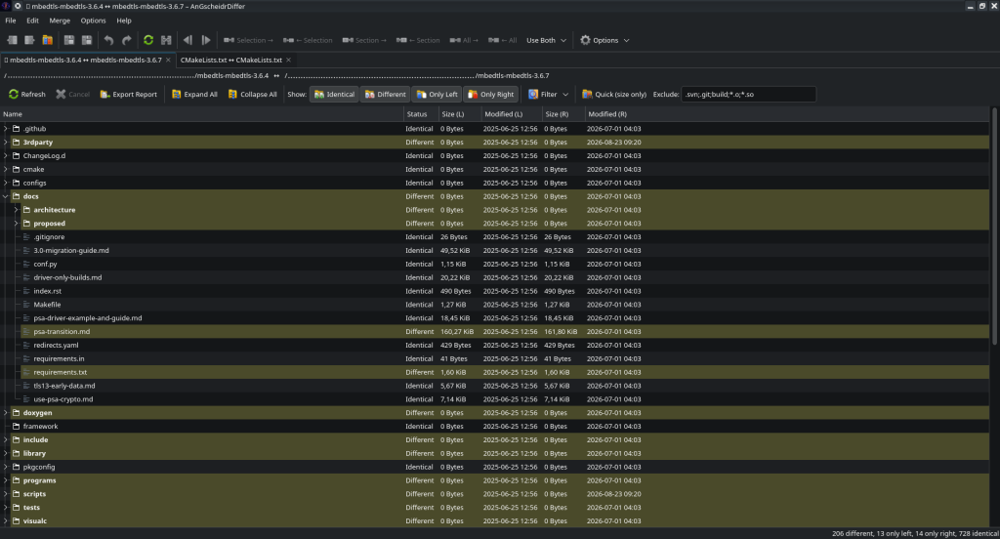
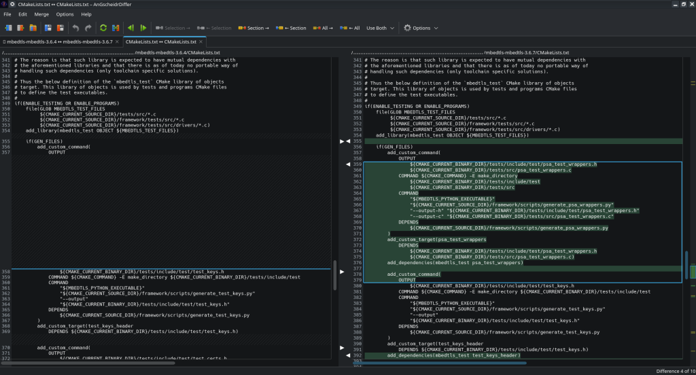

# AnGscheidrDiffer

Side-by-side diff and merge tool for Linux, built with Qt 6.

Both sides stay editable while the comparison is running. Changes are recomputed as you type, and a merge in either direction is a single undo step.

```
open two files  →  step through the differences  →  merge or edit  →  save
```

---

## Features

| Area | Description |
|---|---|
| File comparison | Two editable panes, line numbers, intra-line highlighting of the changed part, an overview bar for the whole file and connector arrows between the panes |
| Merging | Selected lines, the current section or the whole file, in both directions. "Use Both" keeps both variants in the chosen order. Every operation is one undo step |
| Aligned view | Placeholder rows keep matching lines opposite each other. The placeholders exist only while drawing, so editing and undo behave as in a plain editor |
| Folder comparison | Recursive tree with status per entry, copy and delete between the sides, opening either side in the file manager, view filters by name and modification date, and a report export |
| Three-way merge | Base, mine and theirs above the editable result, with conflict navigation and one button per resolution |
| Ignore options | Whitespace, line endings, comments, letter case and the first N lines. The last one covers version control keyword headers |
| Search | Incremental search in the focused pane with wrap-around |
| Export | The comparison as a unified diff |
| Desktop integration | Application launcher and a Dolphin service menu for two selected files or folders |
| Command line | Comparison without a window, with exit codes suitable for scripts |

The application reads and writes only the files named on the command line or opened through the interface. It contacts no network service.

---

## Screenshots

| | |
|---|---|
|  |  |
| Folder comparison, with status per entry | File comparison, with the changed part of each line highlighted |

---

## Requirements

| Item | Requirement |
|---|---|
| Operating system | Linux with a graphical session. Developed and tested on Debian 13 |
| Build tools | CMake 3.16 or newer, a C++17 compiler |
| Libraries | Qt 6 with the Widgets, Concurrent and Test components |
| Optional | KF6SyntaxHighlighting for syntax colours |

The application deliberately depends on Qt alone. KDE Frameworks are not required, so it also runs on desktops other than KDE Plasma.

Built and tested with Qt 6.8.2 and GCC on Debian 13. Older Qt 6 releases have not been tried.

---

## Installation

```bash
sudo apt install cmake g++ qt6-base-dev
git clone <repository-url> angscheidrdiffer
cd angscheidrdiffer
cmake -S . -B build
cmake --build build -j$(nproc)
```

The binary is `build/angscheidrdiffer` and runs without installation. To install it system wide, build a Debian package:

```bash
./scripts/build-deb.sh 1.0.0
sudo apt install ./release/angscheidrdiffer_1.0.0_amd64.deb
```

The complete path, including the service menu and the interaction with a version control client, is described in [Installation](doc/installation.md).

---

## Usage

```bash
angscheidrdiffer left.cpp right.cpp        # compare two files
angscheidrdiffer dir1 dir2                 # compare two folders
angscheidrdiffer --merge base mine theirs -o result.cpp
angscheidrdiffer --batch a b; echo $?      # 0 identical, 1 different, 2 error
```

| Option | Effect |
|---|---|
| `--batch` | Compares without opening a window and reports the result as an exit code |
| `--readonly` | Opens without editing, merging or saving |
| `--merge <base> <mine> <theirs>` | Three-way merge. Combined with `--batch` it writes the result only when no conflict remains |
| `-o`, `--output <file>` | Target file for `--merge`. Without it the result goes to standard output |
| `--select-for-compare` | Remembers a path for a later comparison, without a window |
| `--compare-with` | Compares the remembered path with the given one |

### Keyboard

| Shortcut | Action |
|---|---|
| `Alt+Up` / `Alt+Down` | Previous and next difference |
| `Alt+Left` / `Alt+Right` | Copy the current section to the left or right |
| `Ctrl+Alt+Z` / `Ctrl+Alt+Shift+Z` | Undo and redo the last change |
| `Ctrl+O` / `Ctrl+Shift+O` | Open the left and the right file |
| `Ctrl+S` | Save |
| `Ctrl+F` | Search |
| `F5` | Reload both sides from disk |

---

## Documentation

| Document | Contents |
|---|---|
| [User manual](doc/usage.md) | Working with the application: comparing, merging, folders, three-way merge |
| [Installation](doc/installation.md) | Building, packaging, desktop integration and use as an external diff tool |
| [Developer manual](doc/development.md) | Source layout, the diff and merge engines, rendering and design decisions |
| [Changelog](CHANGELOG.md) | What changed in each version |
| [Contributing](CONTRIBUTING.md) | How to propose a change, and what is expected of it |
| [Security policy](SECURITY.md) | How to report a vulnerability |

---

## Technical outline

The comparison is a Myers difference with prefix and suffix trimming and interned lines. The engine is a static library without any interface code and is covered by its own tests. The interface is a single window with one tab per comparison.

Both the file and the folder comparison use the same ignore pipeline, so a file opened from a folder comparison is judged by the same rules.

---

## License

[MIT](LICENSE.md), Copyright (c) 2026 formic.
